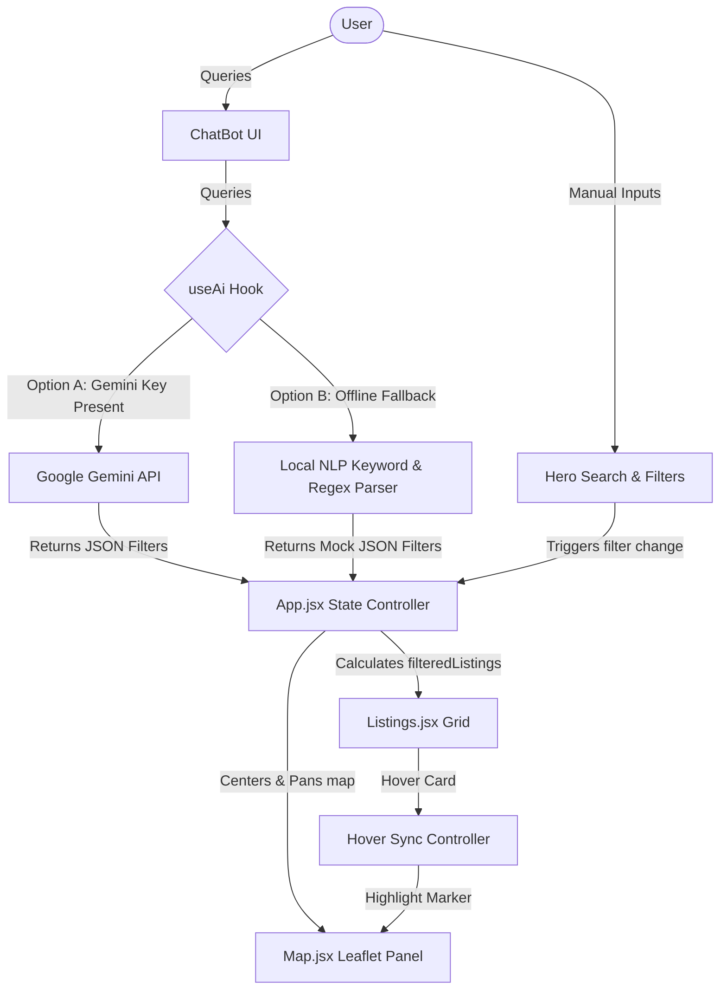

# NestFind - Conversational Rental Search Website

NestFind is a next-generation web application designed to transition apartment and home searching in Vietnam from a static, filter-restricted application into an interactive, AI-driven experience. 

---

## 1. Product Rationale & Problem Definition

### The Problem
Traditional real estate and lodging portals rely on rigid, boolean search filters (e.g., location dropdowns, exact bedroom counts, and strict budget sliders). This forces users to convert their qualitative human goals (e.g., "I need a quiet workspace with good internet in Hanoi for under $50/night") into an exhaustive series of manual filtering steps. 

### The AI Solution
NestFind introduces a **Conversational Search Assistant** integrated directly into the property explorer. 
- **Natural Language Parsing**: Users describe their ideal stay in plain English (or Vietnamese-infused queries).
- **Intelligent Neighborhood Mapping**: The assistant resolves locations to districts (e.g., "Tay Ho" in Hanoi or "Thao Dien" in HCMC) and explains neighborhood highlights.
- **Unified Interface**: Extracted filters automatically update the main listing grid and Leaflet map markers in real time.
- **Robust Fallbacks**: Works out-of-the-box using local Regex/NLP matching if no Gemini API Key is supplied.

---

## 2. System Design & State Flow

The application follows a unidirectional state model where search criteria can be set manually via standard UI inputs or dynamically parsed by the AI.



---

## 3. Technology Stack

- **Core & Framework**: React 19 (Single Page Application) initialized with Vite.
- **Styling**: Vanilla CSS (specifically targeting fluid Flexbox/Grid structures, Custom CSS Variables, custom scrollbars, and keyframe animations).
- **Map Engine**: Leaflet.js via React-Leaflet to render real vector tile maps (CartoDB Voyager style) with interactive markers showing listing prices.
- **AI Integrations**: `@google/generative-ai` SDK using configurable Gemini models (default `gemini-2.5-flash`) with structured JSON output.

---

## 4. Setup & Running Instructions

### Prerequisites
Make sure you have [Node.js (v20+ or newer)](https://nodejs.org/) installed.

### Installation
Clone the repository, navigate to the project folder, and install dependencies:
```bash
npm install
```

### Run Locally (Development Mode)
Start the Vite local development server:
```bash
npm run dev
```
Open your browser and navigate to the printed URL (typically `http://localhost:5173`).

### Build for Production
To bundle and optimize the project for production deployment:
```bash
npm run build
```
You can preview the built bundle locally using:
```bash
npm run preview
```

### Configured AI Key Settings
For security and best practices, the Gemini API key is loaded from the environment:
1. Create a `.env` file in the root directory (you can copy `.env.example`).
2. Add your **Gemini Developer API Key** (obtainable for free from [Google AI Studio](https://aistudio.google.com/)) with the `VITE_` prefix:
   ```env
   VITE_GEMINI_API_KEY=your_gemini_api_key_here
   ```
3. Optionally set a model:
   ```env
   VITE_GEMINI_API_MODEL=gemini-2.5-flash
   ```
4. Restart your development server (`npm run dev`) to apply. The Assistant will now make live calls to Gemini. If this environment variable is not defined or left empty, the application seamlessly falls back to the local keyword parser.
5. `.env` and `.env.local` are ignored by git to prevent accidental secret leakage.

---

## 5. Verification & Testing

### A. Functional Validation

Run parser tests:
```bash
node scripts/test-ai-parser.js
```

Run static checks:
```bash
npm run lint
npm run build
```

Functional checks covered:
- Price boundaries (`under $50`, `cheap`)
- Locations (`Hanoi`, `Saigon`, `Da Nang`)
- Bed configurations (`2 bed`)
- Amenities (`wifi`, `workspace`, `gym`, `pool`)
- AI-to-UI integration (chat applies filters to listings and map)

### B. Business Logic Validation

Validated business rules:
- If AI filters are active, they take precedence over manual search.
- Category pills, manual search, and AI filters stay synchronized.
- Booking and saved listings persist to `localStorage`.
- Invalid/empty AI responses degrade gracefully to error or local parser fallback.

### C. Non-Functional Validation

- **Resilience**: Works without API key via local NLP fallback.
- **Performance**: Production bundle generated and optimized by Vite.
- **Maintainability**: ESLint used for consistent quality gates.

---

## 6. Evaluation & Future Roadmap

### Scaling Plan
- Move listing data to backend APIs + database instead of in-memory fixtures.
- Add server-side pagination, caching, and geo-indexed search.
- Introduce authenticated user profiles for persistent bookings/saved states across devices.

### AI Monitoring Plan
- Log prompt/response metadata (latency, token usage, parse success rate).
- Track filter-application accuracy via sampled QA replay.
- Add alerting for fallback spikes (proxy for model/API instability).

### Edge-Case Handling Plan
- Strict JSON schema validation before applying AI output to UI state.
- Guardrails for unsupported cities/amenities with user-facing clarifications.
- Confidence-scored parsing and optional “Did you mean...” confirmations for ambiguous requests.

---

## 7. Video Walkthrough Deliverable
- Include the final upload link in this section before submission:
  - Video URL: https://youtu.be/zpbrnmpGczk
